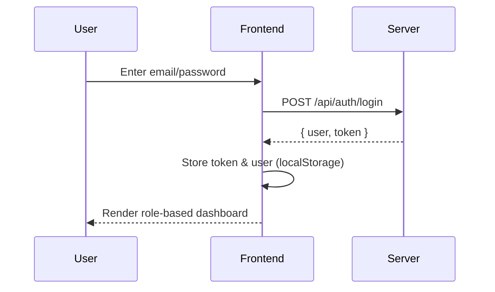
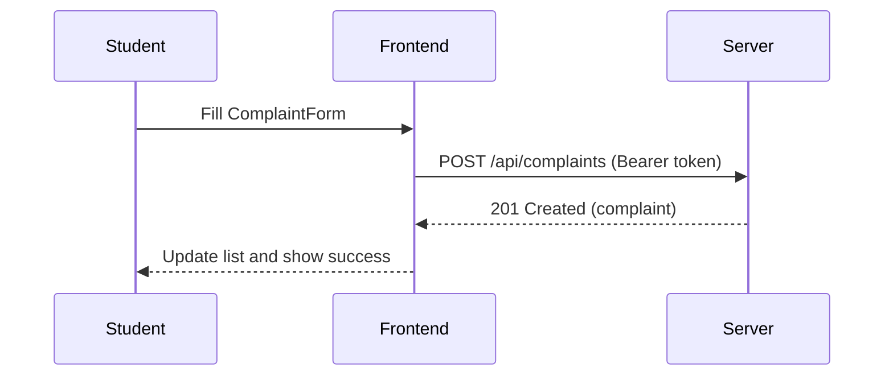
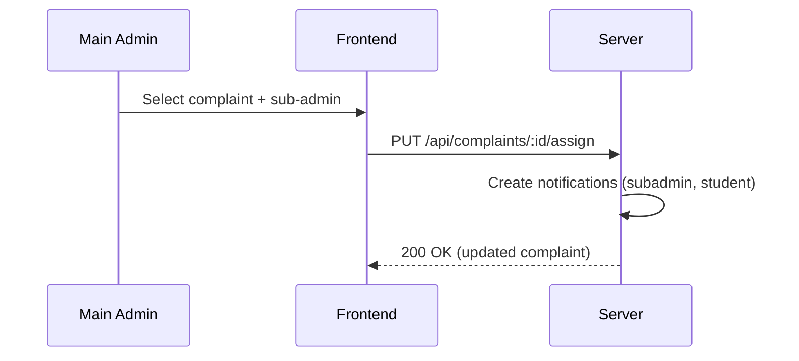
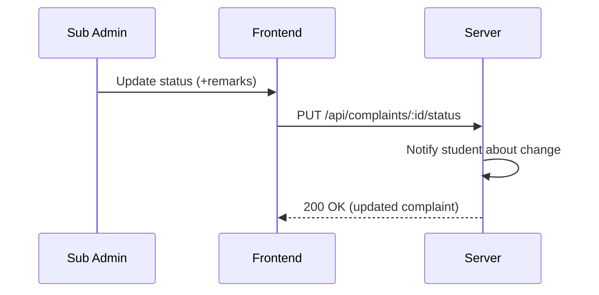

# SafeNest — Smart Complaint & Feedback Portal

## Abstract
SafeNest is a role-based complaint and feedback management system designed for academic institutions. Students can file complaints, Sub-Admins (department admins) triage and resolve department-specific issues, and a Main Admin oversees the entire ecosystem, assigns complaints, and monitors performance. The system is implemented as a modern full‑stack application using React + TypeScript (Vite) and Tailwind CSS on the frontend, and Node.js/Express with MongoDB (Mongoose) and JWT-based authentication on the backend.

## Table of Contents
1. Introduction
2. Objectives and Scope
3. System Overview
4. Architecture and Design
5. Technology Stack
6. Backend Design
7. Database Schema
8. Authentication & Authorization
9. Frontend Design
10. UI/UX & Theming
11. API Contract (Selected Endpoints)
12. Core User Flows
13. Security Considerations
14. Error Handling & Logging
15. Testing Strategy
16. Deployment & Configuration
17. Troubleshooting
18. Future Enhancements
19. Conclusion
20. Appendix: Screenshots

---

## 1. Introduction
Modern institutions require streamlined processes for handling student complaints and feedback. SafeNest provides a centralized, role-aware portal that enables students to submit structured complaints, department admins to manage and resolve them, and central admin to orchestrate assignments and track KPIs. The project emphasizes usability, security, and extensibility.

## 2. Objectives and Scope
- Provide an intuitive portal for complaint submission and status tracking.
- Enable role-based views: Student, Sub‑Admin (Department), and Main Admin.
- Offer administrative capabilities to assign complaints and monitor system-wide metrics.
- Ensure secure authentication, authorization, and data handling using JWT and Mongoose.
- Establish a foundation that can be extended with analytics and notifications.

## 3. System Overview
- Students submit complaints categorized by department, category, and priority.
- Sub‑Admins manage only their department’s complaints, updating statuses with remarks.
- Main Admin can view all complaints, create sub‑admins, and assign complaints to them.
- Notifications are generated for key events (assignment and status changes).

### 3.1 Demo and How It Works (Step‑by‑Step)

This section explains how to run the app locally and what to click for a complete demo.

1) Prerequisites
   - Install Node.js and npm
   - Install and run MongoDB (or point `MONGODB_URI` in `.env` to a hosted cluster)

2) Configure environment
   - Create `.env` in the project root with at least:
     - `PORT=5000`
     - `MONGODB_URI=mongodb://localhost:27017/safenest`
     - `JWT_SECRET=your_strong_secret_here`

3) Start servers
   - Terminal A (API): `npm run server` → Health: `http://localhost:5000/api/health`
   - Terminal B (Frontend): `npm run dev` → UI: `http://localhost:5173`

4) Default demo accounts (auto‑seeded on first DB connection)
   - Main Admin: `admin@safenest.com` / `password123`
   - Sub‑Admin (per department): e.g. `it-admin@safenest.com` or `<department>.admin@safenest.com` / `password123`
   - Students: `student@safenest.com`, `sarah@safenest.com`, `mike@safenest.com` (all `password123`)

5) Quick demo flow
   - Login as a Student → submit a complaint → verify it appears in "My Complaints".
   - Login as Main Admin → view all complaints → assign the student’s complaint to the relevant Sub‑Admin.
   - Login as that Sub‑Admin → open the assigned complaint → change status to "in‑progress" (add remarks) → later to "resolved" (add summary).
   - Switch back to the Student → verify status updates and any notifications.

6) Suggested screenshots (place under `docs/img/`)
   - `01-login.png`, `02-register.png`, `03-student-dashboard.png`, `04-complaint-form.png`, `05-student-complaints.png`
   - `06-subadmin-dashboard.png`, `07-subadmin-complaints.png`, `08-status-update.png`
   - `09-mainadmin-dashboard.png`, `10-assign-complaint.png`, `11-users-list.png`, `12-subadmins-list.png`
   - `13-notifications.png`, `14-analytics.png`, `15-dark-mode.png`

7) What to expect (UI map)
   - Login/Register: role determines which dashboard is shown after login.
   - Student Dashboard: quick stats, "Submit Complaint" modal, filterable list.
   - Sub‑Admin Dashboard: department‑scoped complaints, status update controls with remarks.
   - Main Admin Dashboard: global overview, assignment to sub‑admins, users and sub‑admins lists.

### 3.2 Business Rules (Sourced from `server/index.js`)

- Authentication
  - JWT is required for protected routes. Header: `Authorization: Bearer <token>`.
  - Token payload includes `userId`, `email`, `role`, `department` and expires in 24 hours.

- Users & Roles
  - Roles: `student`, `subadmin`, `mainadmin`.
  - Default seed on first DB connect:
    - Main Admin: `admin@safenest.com` / `password123`.
    - Sub‑Admins: one per department (e.g., `it-admin@safenest.com`, `cs-admin@safenest.com`, others as `<department>.admin@safenest.com`).
    - Departments seeded: Information Technology, Computer Science, Civil Engineering, Electronics, Mechanical, Chemical, Electrical, Biotechnology, MBA, Hostel, Library, Canteen, Sports, Transport, Administration, Physics, Mathematics, Chemistry, English, Other.
    - Sample Students: `student@safenest.com`, `sarah@safenest.com`, `mike@safenest.com` (all `password123`).

- Complaints
  - Status values: `pending`, `in-progress`, `resolved`, `rejected`.
  - Priority values: `low`, `medium`, `high`, `urgent`.
  - Create (`POST /api/complaints`): only authenticated users; complaint is created under the current user as `studentId`, with `status='pending'`.
  - List (`GET /api/complaints`):
    - `student` sees only their complaints.
    - `subadmin` sees complaints where `department` equals their department.
    - `mainadmin` sees all complaints.
  - Assign (`PUT /api/complaints/:id/assign`):
    - Only `mainadmin` can assign complaints to a `subadmin` via `subAdminId`.
    - Assignment sets `assignedTo`, `assignedToName`, keeps status as `pending`, and creates notifications for both the sub‑admin and the student.
  - Update Status (`PUT /api/complaints/:id/status`):
    - `student` cannot update status (forbidden).
    - `subadmin` can update status only if complaint `department` matches their department; when setting to `in-progress` or `resolved`, `remarks` are required.
    - `mainadmin` cannot set status directly to `resolved` (must assign first and sub‑admin resolves). Other transitions allowed per server logic.
    - When status changes, a notification is created for the student with title `Complaint <status>` and the provided `remarks` or a default message.

- Notifications
  - List: `GET /api/notifications?onlyUnread=true|false` (defaults to unread only).
  - Mark single read: `PUT /api/notifications/:id/read` (only the owner can mark).
  - Mark all read: `PUT /api/notifications/read-all`.

- Dashboard Stats (`GET /api/dashboard/stats`)
  - Counts complaints filtered by role user scope (same logic as list).
  - For `mainadmin`, also returns total user counts: students and sub‑admins.

## 4. Architecture and Design
The application follows a client–server architecture.

```mermaid
flowchart LR
  A[React + Vite (Frontend)] -- Axios --> B[(Express API)]
  B -- Mongoose --> C[(MongoDB)]
  A <-- JWT in localStorage --> B
```

- Frontend served via Vite during development; communicates with the API at `http://localhost:5000/api` (see `src/services/api.ts`).
- Backend exposes RESTful endpoints, secures them with JWT middleware, and persists data to MongoDB.

### Module Organization
- Frontend: `src/` with `components/`, `context/`, `services/`, `types/`.
- Backend: `server/index.js` encapsulates models, middleware, and routes (for a small codebase).

## 5. Technology Stack
- Frontend: React 18, TypeScript, Tailwind CSS, Vite, lucide-react icons
- Backend: Node.js, Express, MongoDB (Mongoose), JWT, bcryptjs, CORS, dotenv
- Tooling: ESLint (TypeScript + React), PostCSS, Tailwind

## 6. Backend Design
Backend entry: `server/index.js`.

### 6.1 Key Middleware
- `cors()` enables cross-origin requests during development.
- `express.json()` parses JSON request bodies.
- `authenticateToken` verifies JWT tokens (`Authorization: Bearer <token>`), attaches `req.user`.

### 6.2 Routes (Selected)
- Auth: `POST /api/auth/login`, `POST /api/auth/register`
- Complaints: `GET /api/complaints`, `POST /api/complaints`
- Complaint workflow: `PUT /api/complaints/:id/status`, `PUT /api/complaints/:id/assign`
- Admin: `GET /api/admin/users`, `GET /api/admin/subadmins`, `POST /api/admin/create-subadmin`
- Notifications: `GET /api/notifications`, `PUT /api/notifications/:id/read`, `PUT /api/notifications/read-all`
- System: `GET /api/health`

### 6.3 Initialization
- On successful DB connection, `initializeDefaultUsers()` seeds a main admin, per‑department sub‑admins, and sample students (default password `password123`).

## 7. Database Schema
Defined in `server/index.js` using Mongoose.

### 7.1 User
- Fields: `name`, `email` (unique), `password` (bcrypt hash), `role` (`student|subadmin|mainadmin`), `department?`, `isActive`, timestamps.

### 7.2 Complaint
- Fields: `title`, `description`, `department`, `category`, `priority` (`low|medium|high|urgent`), `status` (`pending|in-progress|resolved|rejected`), `studentId(ref User)`, `studentName`, `studentEmail`, `assignedTo?`, `assignedToName?`, `remarks?`, `attachments?[]`, `resolvedAt?`, timestamps.

### 7.3 Notification
- Fields: `userId(ref User)`, `type` (`assignment|status|general`), `title`, `message`, `complaintId?`, `read`, `createdAt`.

## 8. Authentication & Authorization
- JWT Secret: `process.env.JWT_SECRET` (fallback default for development) used by `jsonwebtoken`.
- Passwords hashed via `bcryptjs` on registration and seeding.
- Role-based enforcement in routes:
  - Only `mainadmin` can assign complaints or create sub‑admins.
  - `subadmin` can update statuses for complaints in their department and must provide remarks for `in-progress`/`resolved`.
  - `student` can submit and list their own complaints but cannot change status.

## 9. Frontend Design
Entry files: `src/main.tsx`, `src/App.tsx`.

### 9.1 State & Context
- `src/context/AuthContext.tsx` handles login/register, token persistence (`localStorage`), and exposes `user`, `login`, `logout`, `updateProfile`.
- `src/context/ThemeContext.tsx` provides light/dark theme toggle (class-based, persisted).

### 9.2 Views & Components
- Role dashboards in `src/components/dashboard/`:
  - `StudentDashboard.tsx`: submit, list, and filter own complaints; access settings.
  - `SubAdminDashboard.tsx`: manage department complaints; update statuses with remarks.
  - `MainAdminDashboard.tsx`: view all complaints, assign to sub‑admins, manage users and sub‑admins.
- Complaints UI: `src/components/complaints/ComplaintForm.tsx`, `ComplaintCard.tsx`.
- Admin: `src/components/admin/CreateSubAdminForm.tsx`.

### 9.3 API Layer
- `src/services/api.ts` wraps Axios with base URL `http://localhost:5000/api`, attaches token via interceptor, and defines typed helpers: `authAPI`, `complaintsAPI`, `adminAPI`, `dashboardAPI`, `notificationsAPI`.

## 10. UI/UX & Theming
- Tailwind CSS with extended animations/colors in `tailwind.config.js`.
- Consistent glassmorphism‑inspired panels, gradients, and dark mode support.
- Accessibility considerations: color contrast and keyboard-focusable controls.

## 11. API Contract (Selected Endpoints)
Examples (responses abbreviated):

- POST `/api/auth/login`
  - Body: `{ email, password }`
  - Response: `{ user, token }`

- POST `/api/auth/register`
  - Body: `{ name, email, password, role: 'student'|'subadmin', department? }`
  - Response: `{ message, user, token }`

- GET `/api/complaints` (auth)
  - Role filtering: students see own, sub‑admins see department, main admin sees all.
  - Response: `Complaint[]` (with populated refs for `studentId`, `assignedTo`).

- PUT `/api/complaints/:id/status` (auth)
  - Body: `{ status, remarks? }` with role/department rules.

- PUT `/api/complaints/:id/assign` (mainadmin)
  - Body: `{ subAdminId, remarks? }`

- Notifications (`/api/notifications`) provide list and mark‑read actions.

## 12. Core User Flows

### 12.1 Login


### 12.2 Submit Complaint (Student)


### 12.3 Assign Complaint (Main Admin)


### 12.4 Update Status (Sub‑Admin)


## 13. Security Considerations
- Password hashing with `bcryptjs` during user creation.
- JWT expiration (`24h`) and guarded endpoints with `authenticateToken`.
- Role checks for sensitive operations (assignment, listing users).
- CORS configured for development; consider production origin allow-list.
- Avoid storing sensitive data in readable client storage beyond what’s necessary.

## 14. Error Handling & Logging
- Server returns descriptive `4xx/5xx` messages; global error middleware returns `500` fallback.
- Client intercepts `401/403` and clears invalid token, redirecting to `/`.
- Console logging added for login attempts and server lifecycle events.

## 15. Testing Strategy
- Unit tests (suggested):
  - Auth route handlers (login/register input validation, token issuance).
  - Complaint status transitions and permission guards.
- Integration tests:
  - End-to-end flows using supertest for Express and a test MongoDB.
- UI tests:
  - Critical paths (login, submit complaint, update status) with React Testing Library / Playwright.

## 16. Deployment & Configuration
- Environment variables in `.env`: `PORT`, `MONGODB_URI`, `JWT_SECRET`.
- Frontend base URL in `src/services/api.ts` (`API_BASE_URL`). Consider using Vite env (`import.meta.env.VITE_API_URL`).
- Production build: `npm run build` for frontend; deploy server separately. Optionally have Express serve `dist/` as static files.

## 17. Troubleshooting
- MongoDB connectivity: verify `MONGODB_URI` and DB availability; server has retry logic.
- Auth failures: ensure valid token; watch axios interceptor behavior.
- CORS: ensure allowed origins in production.
- Port conflicts: change `PORT` or Vite dev server port.

## 18. Future Enhancements
- File uploads for attachments with secure storage (S3, Cloud Storage).
- Pagination, search, and advanced filters on complaints.
- Role management UI and audit logs.
- Email/WebPush notifications; scheduled digests.
- Exportable reports and more robust analytics dashboards.

## 19. Conclusion
SafeNest demonstrates a pragmatic, secure, and extensible approach to complaint management in an academic setting. Its modular architecture, typed frontend, and simple yet powerful backend provide a strong foundation for further growth.

## 20. Appendix: Screenshots
Place screenshots in `docs/img/` and reference as below. Example list to capture:

1. Login Screen — `docs/img/01-login.png`
2. Register Screen — `docs/img/02-register.png`
3. Student Dashboard (Overview) — `docs/img/03-student-dashboard.png`
4. Submit Complaint Modal/Form — `docs/img/04-complaint-form.png`
5. Student Complaints List — `docs/img/05-student-complaints.png`
6. Sub‑Admin Dashboard (Overview) — `docs/img/06-subadmin-dashboard.png`
7. Sub‑Admin Complaints with Filters — `docs/img/07-subadmin-complaints.png`
8. Update Status (with Remarks) — `docs/img/08-status-update.png`
9. Main Admin Dashboard (Overview) — `docs/img/09-mainadmin-dashboard.png`
10. Assign Complaint to Sub‑Admin — `docs/img/10-assign-complaint.png`
11. Users List (Main Admin) — `docs/img/11-users-list.png`
12. Sub‑Admins List with Credentials Tip — `docs/img/12-subadmins-list.png`
13. Notifications Panel/States — `docs/img/13-notifications.png`
14. Analytics View — `docs/img/14-analytics.png`
15. Theme Toggle (Dark Mode) — `docs/img/15-dark-mode.png`

Markdown references (insert after adding files):

```markdown


...
```

---

Prepared on: 2025-09-24
